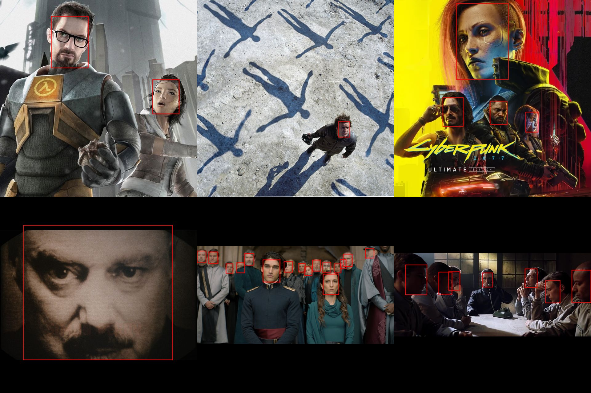

# A simple deno YOLO interface



A small project for running a YOLO singe-object detection model in Deno.
All in a single file...


This project provides a Deno-based interface to run YOLOv8 models for detecting a single object in images (e.g., a person, a banana, etc.).
It handles image preprocessing, tensor preparation, and bounding box visualization using Sharp and ONNX Runtime.

## Why I Made This Project

I created this project to explore and learn about running machine learning models at a lower level and to goin a some basic experience with model inference. Using **ONNX** format, I wanted to experiment with a portable format that could be used in web-oriented environments.  

I chose **TypeScript and Deno** because I enjoy working with them more than Python, and I wanted to explore machine learning workflows outside the usual Python ecosystem.  

Finally, this project serves as a **demonstration of my problem-solving skills and basic understanding of ML pipelines**, from preprocessing images to running models and visualizing outputs.

## Supported Models
- YOLO single-object detection models only
  - Example: yolov8n.pt converted to ONNX
  - You can get a ready to use from [HugginfFace](https://huggingface.co/AdamCodd/YOLOv11n-face-detection/tree/main) ([Direct download link](https://huggingface.co/AdamCodd/YOLOv11n-face-detection/resolve/main/model.pt?download=true)). This one is specialized in **facial detection**.

## Requirements

- An capable computer (wathever that means).
- An **ONNX** of a `YOLO` model for **SINGLE OBJECT** detection only. (Provided link of a `YOLOv11` model works)
- A few RGB images specific to your model of choise.

## Installation

This project was written for **Deno 2.4**. Older versions might not work.

1. Clone the repository

2. Install all needed dependencies:
   ```
   deno install --allow-scripts
   ```

3. Place your `YOLOv8 onnx` in `./models`
   - The script by default expects the onnx file to be named `model.onnx`. If your model is named differet, either rename it or search in `main.ts` for `const modelName` and replace its value with the correct name.

## Running the project

Running the project is very simple, just use the following command:
```
deno run main
```
Let the magic begin!

## After running

Now that you ran the project, nothing seem to have happened...
The results are in a separate folder for you to look at, located in `./outputImgs`, enjoy!
